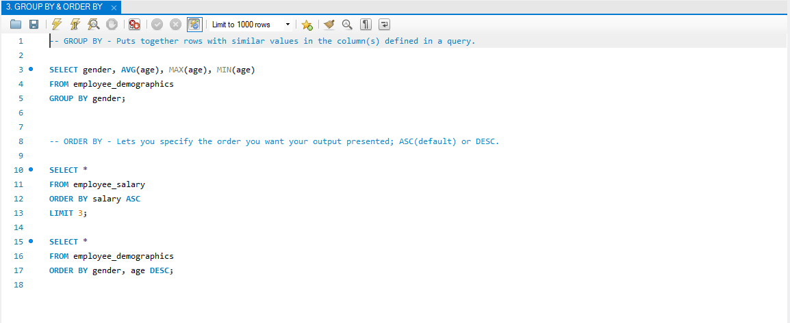
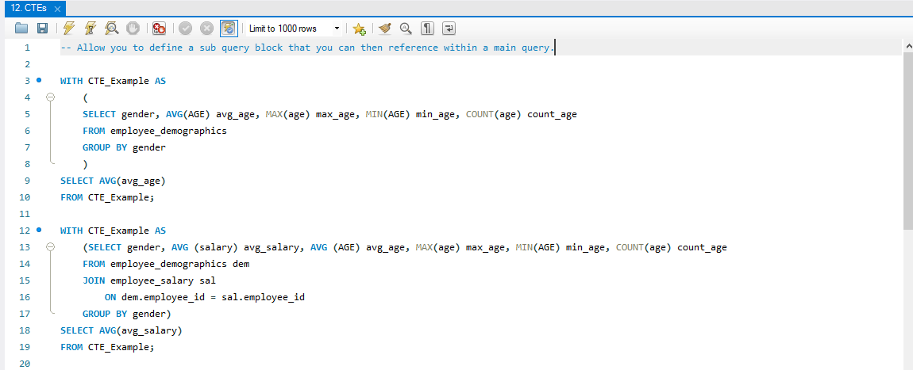
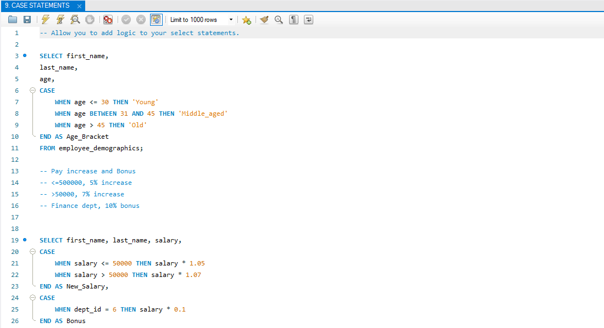
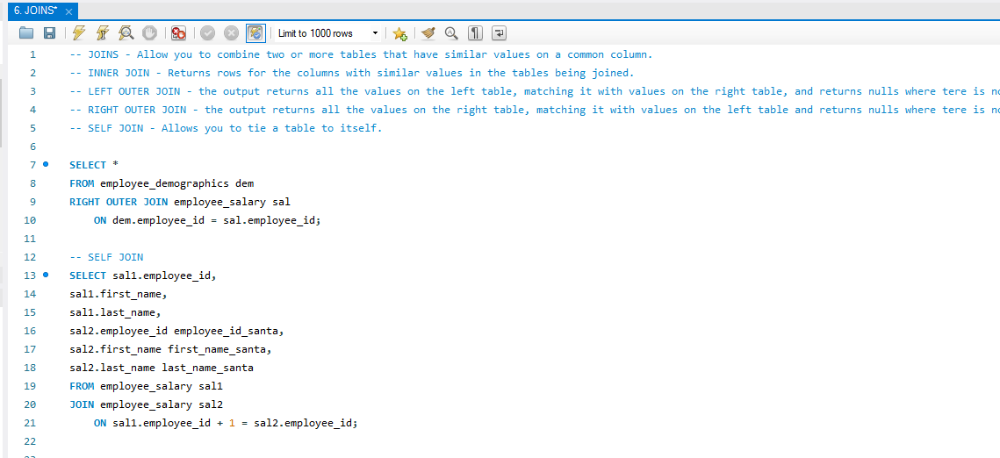
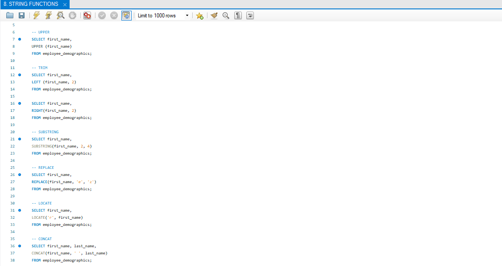
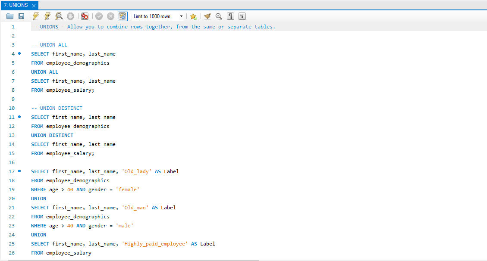
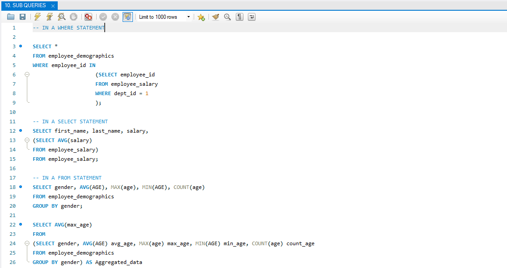

# finance-sql-toolkit

# SQL Functions Examples

A practical collection of SQL examples covering commonly used functions and techniques.

## Contents

### ORDER BY
Sorting results in ascending or descending order.

---

### GROUP BY
Aggregating data by one or more columns.

---

### Window Functions
Examples using `ROW_NUMBER()`, `RANK()`, `DENSE_RANK()`, and windowed `SUM()`.

---

### Common Table Expressions (CTEs)
Using `WITH` clauses to structure and simplify queries.

---

### CASE Statements
Conditional logic inside SQL queries.

---

### Joins
Combining data from multiple tables (`INNER`, `LEFT`, etc.).

---

### String Functions
Examples using `CONCAT`, `LENGTH`, `UPPER`, `LOWER`, and related functions.

---

### UNION
Combining results from multiple queries.

---

### Subqueries
Using nested queries to filter or calculate intermediate results.

---

## Notes
These examples demonstrate practical SQL techniques I use in data analysis and finance-related work.
